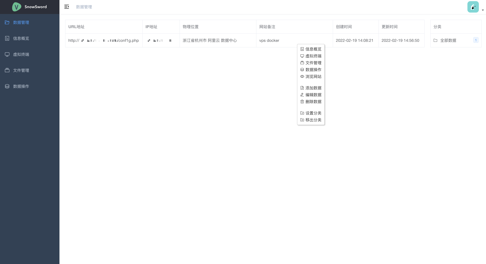
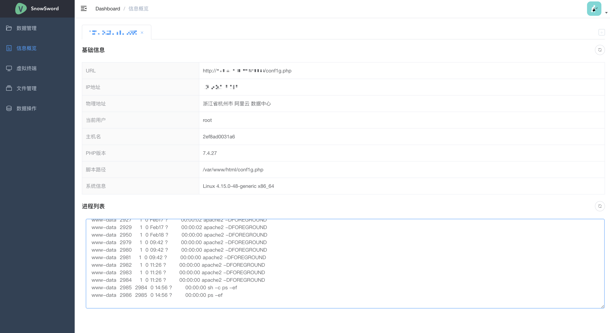
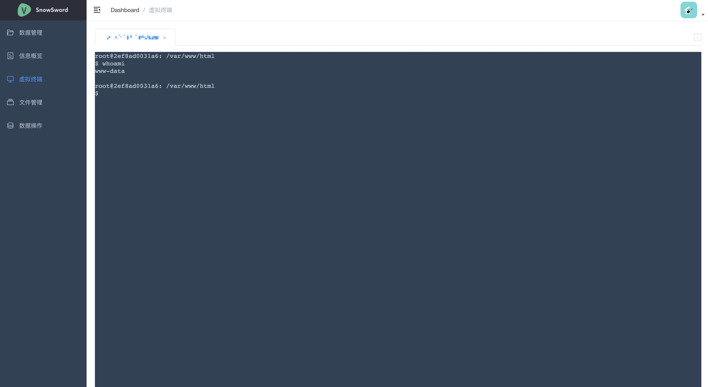
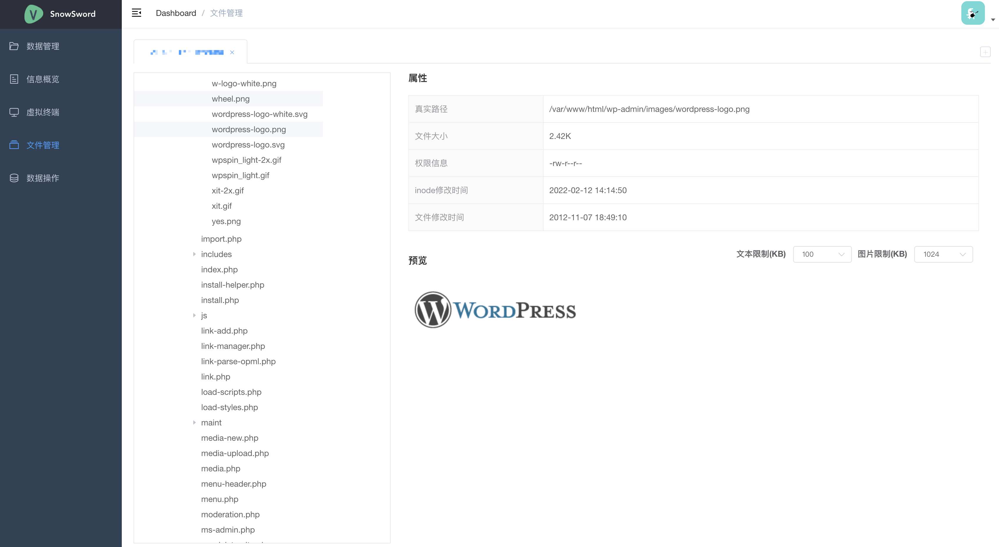
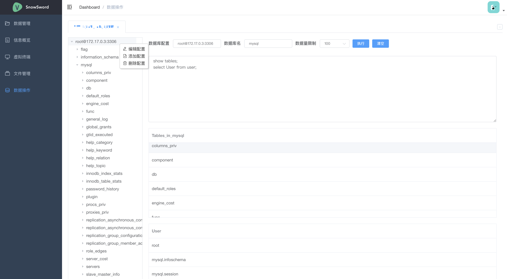

# SnowSword
Web版菜刀（Webshell管理工具）

# 截图






# Docker启动
```bash
git clone git@github.com:l3yx/SnowSword.git
cd SnowSword/Docker
docker-compose build
docker-compose up -d
```

访问：http://ip:8081

第一次登录用户名使用admin，密码随意，登录后密码则设置为初次登录密码


# 免责声明
雪剑是一款开源的Web版网站管理工具，仅限于安全研究与教学使用，任何人不得将其用于非法用途，否则自行承担全部法律后果！